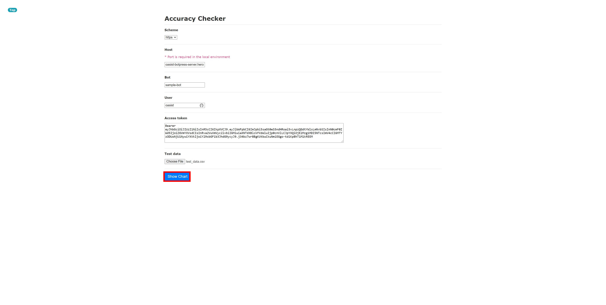

## 3. Check Q&As' accuracy

1. Access [Botpress Accuracy Checker > Accuracy Checker](https://botpress-accuracy-checker.herokuapp.com/accuracy-check/select), fill in all required parameters with a [CSV test data](../csv/test_data.csv) and click `Show Chart`.

2. After a few seconds, an accuracy score chart for each Q&A appears. Click `Download CSV` to save it as a [CSV accuracy score chart](../csv/accuracy_score_chart_20211130220255.csv).

