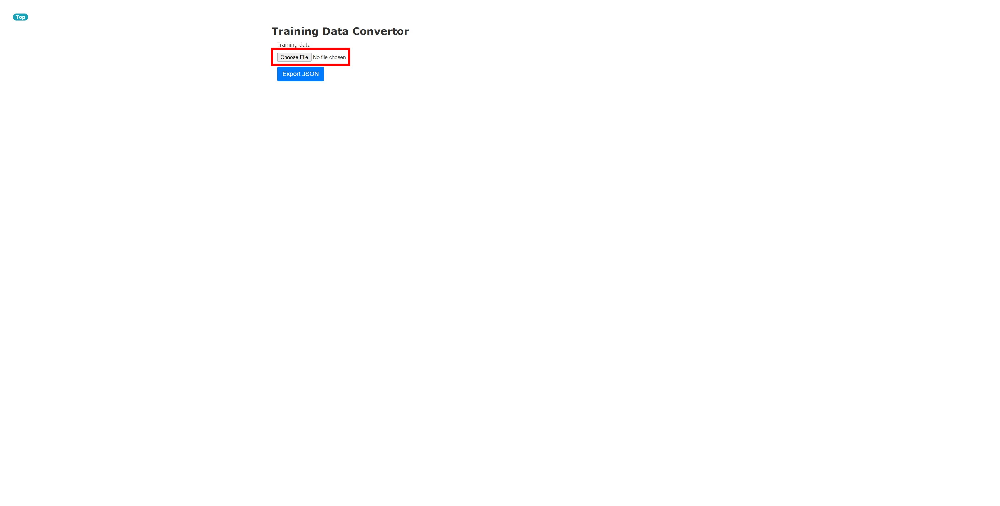
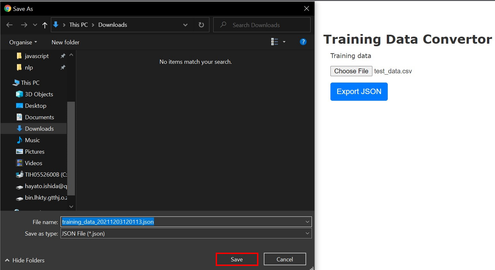
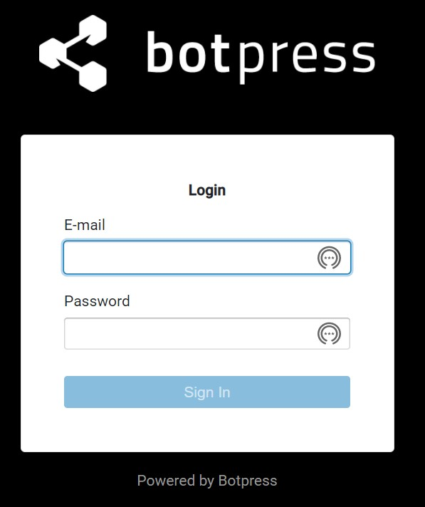
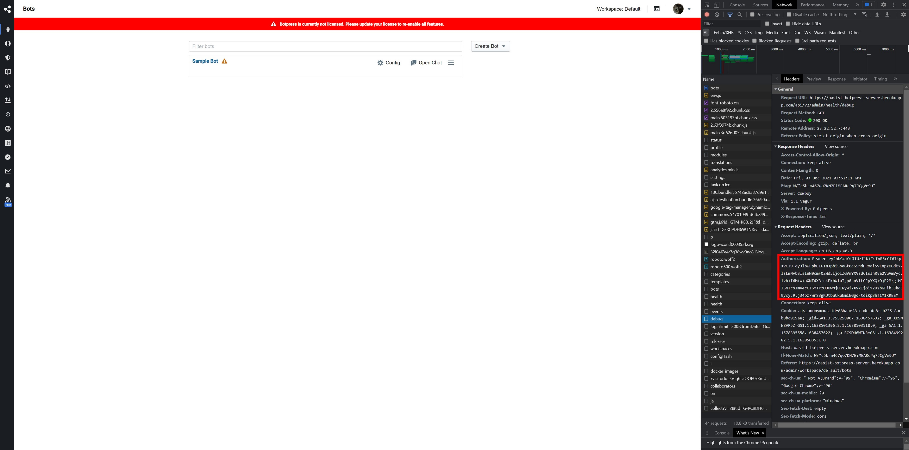

## 2. Training Q&As

### 2-1. Prepare JSON training data

1. Access [Botpress Accuracy Checker > Training Data Convertor](https://botpress-accuracy-checker.herokuapp.com/training-data/select).

2. Click `Choose File` and choose a [CSV training data](../csv/training_data.csv).

3. Click `Export JSON`.

4. Download the [JSON training data](../json/training_data_20211129121638.json) on your local storage.

### 2-2. Train Q&As in Botpress Server

1. Access your Botpress Server and login.

2. On the top page, select `New Bot`.

3. Name the bot as you like, select `Empty Bot` in 'Bot Template' section and click `Create Bot`.

4. Again on the top page, choose the bot you have just created.

5. Click 'Bottom Panel' icon and a gear icon, define your User ID and save it, and close the panel.

6. In 'Config' section, set `Japanese` as the default language.

7. In 'Q&A' section, click 'Import JSON' icon.

8. Click `Browse`, choose the JSON training data you have just downloaded and click `next`.

9. Choose an item of 2 radio buttons according to your need and click `Submit`.

10. After upload is done, 'Upload Successfully' message appears. Then click `Train Chatbot`.

11. Check if the chatbot properly responses to your question in Emulator.

12. Go to the top page, open the inspector and get a Bearer token on 'Network' section.

